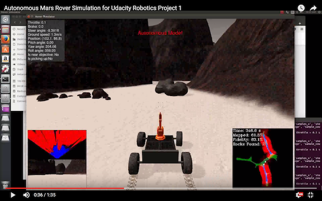
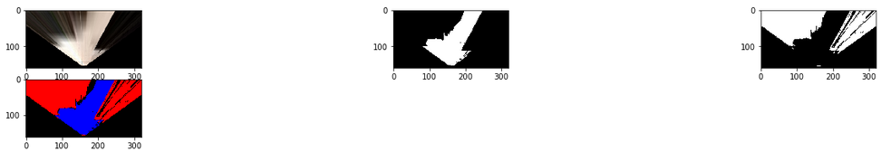
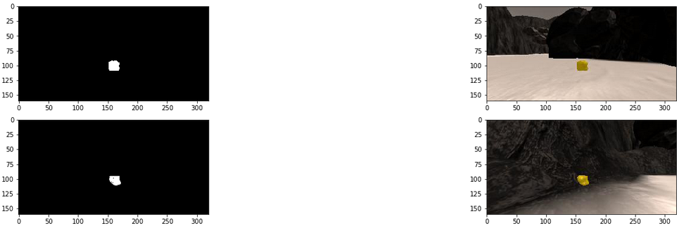
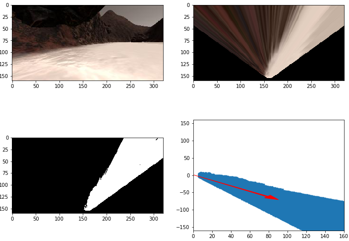
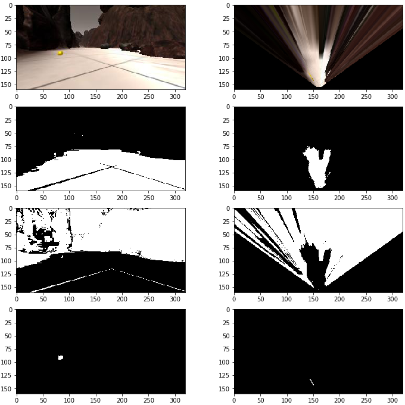
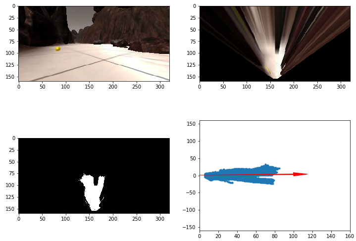

# Project: Search and Sample Return
---
## Introduction

This project is the first one in Udacity's Robotics Nanodegree. It introduces the basics of robotics via a Mars rover 
simulation. Students are asked to write code implementing rudimentary computer vision techniques and conditional 
statements to build an autonomous rover to navigate its environment and collect rock samples.

Video of one of my autonomous runs:

**The goals / steps of this project are the following:**  

**Training / Calibration**  

* Download the simulator and take data in "Training Mode"
* Test out the functions in the [provided Jupyter Notebook](code/Rover_Project_Test_Notebook.ipynb)
* Add functions to detect obstacles and samples of interest (golden rocks)
* Fill in the `process_image()` function with the appropriate image processing steps (perspective transform, color threshold etc.) to get from raw images to a map.  The `output_image` created in this step should demonstrate that the mapping pipeline works.
* Use `moviepy` to process the images in the [saved dataset](training/) from a simulator run with the `process_image()` function to produce a video (included as part of the project submission).

**Autonomous Navigation / Mapping**

* Fill in the `perception_step()` function within the `perception.py` script with the appropriate image processing functions to create a map and update `Rover()` data (similar to what is done in `process_image()` in the notebook). 
* Fill in the `decision_step()` function within the `decision.py` script with conditional statements that take into consideration the outputs of the `perception_step()` in deciding how to issue throttle, brake and steering commands. 
* Iterate on the perception and decision function until your rover maps:
  1. at least 40% of the environment with 60% fidelity/accuracy against the ground truth map
  2. the location of at least 1 rock sample

## [Rubric](https://review.udacity.com/#!/rubrics/916/view) Points
---
### Writeup / README

#### 1. Provide a Writeup / README that includes all the rubric points and how you addressed each one. 

You're reading it!

### Notebook Analysis

See the [Jupyter notebook](code/Rover_Project_Test_Notebook.ipynb) for more details of the image processing 
implementations.

#### 1. Run the functions provided in the notebook on test images (first with the test data provided, next on data you have recorded). Add/modify functions to allow for color selection of obstacles and rock samples.

The `perspect_transform()` function was given to us in the notebook. The `color_thresh()` function has been expanded to 
include thresholded binary images of obstacles and golden rock samples, in addition to the binary thresholded image of 
navigable ground. The 3 binary images are included in the 3 different RGB channels of the returned `color_select` NumPy 
array/image mask. The coordinate transform functions are basically the same as the ones found in the lesson exercises, 
so the code that wasn't already provided in the notebook was from the lessons. The below images include the 
rover-centric coordinate transformations. The world map coordinate transformation results are shown in the 
[video output file](output/test_mapping.mp4).

##### On Provided Test Images

##### On Recorded Training Data
Based on this [image captured from a recorded training run](recorded_images/rock_obstacles.jpg):

#### 2. Populate the `process_image()` function with the appropriate analysis steps to map pixels identifying navigable terrain, obstacles and rock samples into a worldmap.  Run `process_image()` on your test data using the `moviepy` functions provided to create video output of your result. 
[Training run video](output/test_mapping.mp4)

The `process_image()` function was modified to include the aforementioned `perspect_transform()`, `color_thresh()`, and 
coordinate transform functions. The binary thresholded and perspective warped image mask returned from `color_thresh()` 
is used to calculate the rover-centric coordinates of the images, which are subsequently used to calculate the world 
map image when combined with the rover telemetry state data for that image frame.

The coordinate transformations are implemented serially one color channel at a time for each of the 3 channels, but 
could be done in parallel, especially in a GPU with a tensor calculation library like TensorFlow.

Also, note that the binary thresholded image must be multiplied by 255 in order for it to be seen in the video output. 

### Autonomous Navigation and Mapping

#### 1. Fill in the `perception_step()` (at the bottom of the `perception.py` script) and `decision_step()` (in `decision.py`) functions in the autonomous mapping scripts and an explanation is provided in the writeup of how and why these functions were modified as they were.

##### `perception_step()`
It's basically the same as the `process_image()` implementation except that the `RoverState` class is used instead of 
`Databucket`.

##### `decision_step()`
* A helper function `default_steer()` was created to encapsulate changes to the default steering strategy (e.g., 
"wall crawling").
* A conditional block checking if the rover is stuck. If acceleration/recent history of velocity is below a certain 
magnitude, then the rover will drive backwards. The video of one of my autonomous runs (linked near the top) shows this 
scenario. Modifications to `supporting_functions.py` and the `RoverState` class in `drive_rover.py` were made in support 
of that scenario. Throttle and brake modifications were also made to make the rover slower and more stable in order to 
produce a high fidelity world map, although max allowable velocity was increased.

#### 2. Launching in autonomous mode your rover can navigate and map autonomously.  Explain your results and how you might improve them in your writeup.  

**Simulator Settings**
* Resolution: 1600x1024
* Quality: Fantastic
* FPS: 16 to 22

**Approach**
Iteratively tried different modifications by running the rover simulator in autonomous mode for several minutes. I 
settled on a slow and steady approach to cover the terrain with high fidelity (at the cost of taking more time, of 
course). Due to lack of time before the deadline, none of the extra challenge tasks were implemented. However, I did try 
to modify the default steering angle in the attempt to make the rover a "wall crawler." Unfortunately, I couldn't get 
the rover to drive well as a wall crawler after trying various parameters.

**Techniques**
Basic computer vision -- perspective transform, color thresholding.

**What worked**
* Slow and steady approach worked well for attaining the required goal of mapping at least 40% of the ground truth with at least 60% fidelity.
* Quickly reversing upon detecting that the rover is stuck

**Potential Pipeline Failure Modes**
* darker, stormier weather and lighting conditions would invalidate the statically defined color thresholds
* rougher terrain would prevent capturing high fidelity map unless pitch and yaw were included in perspective transform and/or rover had better shock absorbers and suspension system

**Ideas for Improvement**
* Parallelize coordinate transformations across all 3 color channels (as previously mentioned)
* Include Pitch & Roll in Perspective Transform
* Path Planning: In order to find its way pack to the starting point, a path planning algorithm like A* should be included.
* Deep Reinforcement Learning: Ideally, the rover would train itself over many simulation runs instead of me as the learning agent having to hard-code rules in `decision.py` and starting the simulator myself every time. OpenAI has recently open sourced tools such as Gym, Universe, and RoboSchool that may potentially be useful. Erle Robotics extended OpenAI's software to work with ROS (https://github.com/vmayoral/basic_reinforcement_learning/tree/master/tutorial7).
